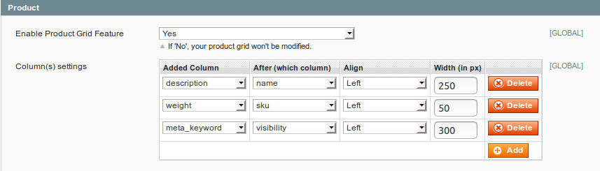

# Okaeli_Grids


--------------------
```
@category   Okaeli  
@package    Okaeli_Grids  
@author     Julien Loizelet <julienloizelet@okaeli.com>  
@copyright  Copyright (c)  2018 Julien Loizelet  
@license    GNU GENERAL PUBLIC LICENSE Version 3
  
```

> How many times have you been asked to add some field in a grid ?
> If your answer is _"too many times"_, then you may give a try to this extension.

**Table of Contents**
--------------------------

  * [Description](#description)
  * [Usage](#usage)
     * [Use cases](#use-cases)
     * [Features](#features)
     * [Configurations](#configurations)
  * [Installation](#installation)
     * [Requirements](#requirements)
     * [Modman](#modman)
     * [Composer](#composer)
     * [Manually](#manually)
  * [Technical Notes](#technical-notes)
     * [No rewrite. Events driven development.](#no-rewrite-events-driven-development)
     * [Extension events](#extension-events)
     * [Integration Tests](#integration-tests)
     * [Coding Standards](#coding-standards)
  * [Support](#support)
  * [Contribution](#contribution)
  * [License](#license)

Created by [gh-md-toc](https://github.com/ekalinin/github-markdown-toc)


## Description

`Okaeli_Grids` is a Magento 1 extension that allows to add column(s) in grid(s) after a specified column.

Available grids are `product`, `order`, `invoice`, `customer`, `cms page`, `cms block` and `newsletter subscriber` grids.

Available new fields are the attributes of the model concerned by the grid.

## Usage

### Use cases

- You just created a product attribute `my_awesome_attribute` and want to display it in product grid.
- Someone asked you to add the `meta_description` data in the Cms Pages grid.

### Features

- Foreach available grid, you can choose a new field to add. You can also set after which column this new column will appear.
Finally, you can set the align style and width of the new column.



- You can enable/disable each feature individually or enable/disable all at once.

- There is a debug log feature that you can turn on/off as you wish.


### Configurations

This extension comes with some configurations :

`System Configuration > Okaeli > Okaeli Grids`

  * **_General_**
    * Enable / Disable all features
    * Enable / Disable debug log
  * **_Product_**
    * Enable / Disable Product Grid Feature
    * Column(s) settings
  * **_Customer_**
    * Enable / Disable Customer Grid Feature
    * Column(s) settings
  * **_Order_**
    * Enable / Disable Order Grid Feature
    * Column(s) settings
  * **_Invoice_**
      * Enable / Disable Invoice Grid Feature
      * Column(s) settings
  * **_Cms Page_**
    * Enable / Disable Cms Page Grid Feature
    * Column(s) settings
  * **_Cms Block_**
    * Enable / Disable Cms Block Grid Feature
    * Column(s) settings
  * **_Subscriber_**
      * Enable / Disable Subscriber Grid Feature
      * Column(s) settings


## Installation

This extension can be installed with [modman](#modman), [composer](#composer) or [manually](#manually).

### Requirements

- Magento < 2

Tested on `1.9.3.6` only but it should work on earlier versions.

### Modman

- Install [modman](https://github.com/colinmollenhour/modman).
- From your Magento installation folder, run `modman init`.
- Then
  - Option 1)
    ```
    modman clone git@github.com:julienloizelet/magento1-grids.git
    ```

  - Option 2) : clone this repo in `/path/to/your/clone/of/this/repo` and
    ```
    modman link /path/to/your/clone/of/this/repo
    ```

### Composer

- Install [composer](http://getcomposer.org/download/).
- Modify your `composer.json` file :

  - Option 1) : get the package from [Packagist](https://packagist.org/).
    ```
    "require": {
      "okaeli/magento1-grids":"*"
    }
    ```

  - Option 2) get the package from [Firegento](http://packages.firegento.com/).

    ```
    "require": {
      "okaeli/magento1-grids":"*"
    },
    "repositories": [
      {
        "type": "composer",
        "url": "https://packages.firegento.com"
      }
    ]
    ```

  - Option 3): get the package from [Github](https://github.com/).

    ```
    "require": {
      "okaeli/magento1-grids":"dev-master"
    },
    "repositories": [
      {
        "type": "vcs",
        "url": "https://github.com/julienloizelet/magento1-grids"
      }
    ]
    ```
- Then from your composer.json folder, run `php composer.phar install` or `composer install`.

### Manually

You can copy the files from the folders of this repository to the same folders of your installation.

## Technical Notes

### No rewrite. Events driven development.

This extension is **0 rewrite**  guaranteed. The following events are listened:

  * `core_block_abstract_to_html_before` : used to add column to grid.
  * `eav_collection_abstract_load_before` : used to add attributes to eav model collection (`product` and `customer`).
  * `sales_order_grid_collection_load_before` : used to join order grid table with order table.
  * `sales_order_invoice_grid_collection_load_before` : used to join invoice grid table with invoice table.


### Extension events

If you want to add more complex field (e.g join with other tables), you should extend this extension and/or use some custom dispatched events :

  * `okaeli_grids_column_add_before`, `okaeli_grids_column_add_after` : use it to add your own column.
  * `okaeli_grids_eav_collection_after` : use it to join on eav collection.

### Integration Tests

* Install first the `Codex_Xtest` extension : [find it here](https://github.com/code-x/magento-xtest).
* Check that you retrieved the `tests` folder of this extension.
* Set `active=true` in the `app/etc/modules/Codex_Xtest.xml` file (Beware that this extension will rewrite the `core/resource` model).
* To run all the test of the `Okaeli_Grids` extension, run the following command:
```
cd tests/
php phpunit.phar ../app/code/community/Okaeli/Grids/Test
```
* To run a specific test (for example tests for the product grid), run the following command:
```
cd tests/
php phpunit.phar ../app/code/community/Okaeli/Grids/Test/Integration/Admin/ProductGridTest.php
```

### Coding Standards

This extension has been checked with the [Magento Extension Quality Program Coding Standard](https://github.com/magento/marketplace-eqp).
You can find the output of the command `phpcs /path/to/Okaeli/Grids/sources --standard=MEQP1` in [this file](doc/coding-standard/magento-eqp.txt).

## Support

If you encounter any problems/bugs or if you have an idea of a new feature, please read the ["How to submit an issue"](.github/ISSUE_TEMPLATE.md) file
and create an issue on [GitHub](https://github.com/julienloizelet/magento1-grids/issues).

## Contribution

Any contribution is highly welcome. The best possibility to provide any code is to open
a [pull request on GitHub](https://help.github.com/articles/using-pull-requests).

Please read the ["How to contribute"](.github/CONTRIBUTING.md) file.

## License

[GNU General Public License, version 3 (GPLv3)](http://opensource.org/licenses/gpl-3.0)