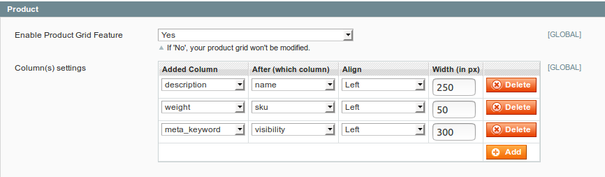

# Okaeli_Grids

--------------------
```
@category   Okaeli  
@package    Okaeli_Grids  
@author     Julien Loizelet <julienloizelet@okaeli.com>  
@copyright  Copyright (c)  2018 Julien Loizelet  
@license    GNU GENERAL PUBLIC LICENSE Version 3
  
```

> How many times how you been asked to add some field in a grid ?
> If your answer is _"too many times"_, then you may give a try to this extension.

## Description

`Okaeli_Grids` is a Magento 1 extension that allows to add column(s) in grid(s) after a specified column.

Available grids are `product`, `order`, `customer`, `cms page` and `cms block` grids.
Available new fields are the attributes of the model concerned by the grid.


## Installation

This extension can be installed with `modman` or `composer`.

### Requirements

- Magento >= 1.6 (probably much earlier, but I didn't test)

### Modman

Run `modman link /path/to/your/clone/of/this/repo` at root of your Magento Project
(Initialize modman with `modman init` if necessary).


### Composer

In your `composer.json` file, add
```
 {
"type": "vcs",
"url": "https://github.com/julienloizelet/magento1-grids"
 }
```
in the `repositories` part and
```
"okaeli/magento1-grids":"dev-master"
```
in the `require` part.


## Usage

### Features

- Foreach available grid, you can choose a new field to add. You can also set after which column this new column will appear.
Finally, you can set the align style and width of the new column.



- You can enable/disable each feature individually or enable/disable all at once.

- There is a debug log feature that you can turn on/off as you wish.


### Configurations

This extension comes with some configurations :

`System Configuration > Okaeli > Okaeli Grids`

  **_General_**

  * Enable / Disable all features
  * Enable / Disable debug log

  **_Product_**

  * Enable / Disable Product Grid Feature
  * Column(s) settings

  **_Customer_**

  * Enable / Disable Customer Grid Feature
  * Column(s) settings

  **_Order_**

  * Enable / Disable Order Grid Feature
  * Column(s) settings

  **_Cms Page_**

  * Enable / Disable Cms Page Grid Feature
  * Column(s) settings

  **_Cms Block_**

  * Enable / Disable Cms Block Grid Feature
  * Column(s) settings


## Technical Notes

### No rewrite. Events driven development.

This extension is **0 rewrite**  guaranteed. The following events are listened:

  * `core_block_abstract_to_html_before` : used to add column to grid.
  * `eav_collection_abstract_load_before` : used to add attributes to eav model collection (`product` and `customer`).

### Extension events

If you want to add more complex field (e.g join with other tables), you should extend this extension and use some custom dispatched events :

  * `okaeli_grids_column_add_before`, `okaeli_grids_column_add_after` : use it to add your own column
  * `okaeli_grids_eav_collection_after` : use it to join on eav collection.

### Integration Tests


* Install first the `Codex_Xtest` extension : [find it here](https://github.com/code-x/magento-xtest)
* Check that you retrieved the `tests` folder of this extension.
* Set `active=true` in the `app/etc/modules/Codex_Xtest.xml` file. (Beware that this extension will rewrite the `core/resource` model)
* To run all the test of the `Okaeli_Grids` extension, run the following command:
```
$ cd tests/
$ php phpunit.phar ../app/code/community/Okaeli/Grids/Test
```
* To run a specific test (for example tests for the product grid), run the following command:
```
$ cd tests/
$ php phpunit.phar ../app/code/community/Okaeli/Grids/Test/Integration/Admin/ProductGridTest.php
```

### Coding Standards

This extension has been checked with the [Magento Extension Quality Program Coding Standard](https://github.com/magento/marketplace-eqp).
You can find the output of the command `phpcs /path/to/Okaeli/Grids/sources --standard=MEQP1` in [this file](doc/coding-standard/magento-eqp.txt).

## Support


If you encounter any problems or bugs, please create an issue on
[GitHub](https://github.com/julienloizelet/magento1-grids/issues).

## Contribution


Any contribution is highly welcome. The best possibility to provide any code is to open
a [pull request on GitHub](https://help.github.com/articles/using-pull-requests).

## License

[GNU General Public License, version 3 (GPLv3)](http://opensource.org/licenses/gpl-3.0)